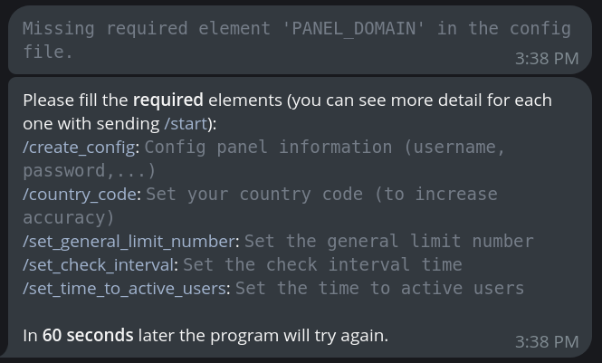

<center>

# V2IpLimit

<b>Limiting the number of active users with IP for [Marzban](https://github.com/Gozargah/Marzban)</b><sub> (with xray logs)</sub><br>
Supports both IPv4 and IPv6 And Marzban-node
<sub>(Tested on Ubuntu 22.04 & 24.04, Fedora 39 & 40)</sub>

</center>

<hr>

## Table of Contents

- [Installation](#installation)
- [Telegram Bot Commands](#telegram-bot-commands)
- [Common Issues and Solutions](#common-issues-and-solutions)
- [Using Cron Jobs](#using-cron-jobs)
- [Build](#build)
- [Donations](#donations)

## Installation

You can install V2IpLimit by running the following command in your terminal:

```bash
bash <(curl -sSL https://houshmand-2005.github.io/v2iplimit.sh)
```

After running the command, you will see a menu with the following options:

```
-----------------------------
1. Start the script
2. Stop the script
3. Attach to the script
4. Update the script
5. Create or Update telegram BOT_TOKEN
6. Create or Update ADMINS
7. Exit
-----------------------------
Enter your choice:
```


And after that you need input your panel information and other settings:



After that script runs automatically and you can see the logs.

## Telegram Bot Commands

V2IpLimit can be controlled via a Telegram bot. Here are the available commands:

- `/start`: Start the bot.
- `/create_config`: Configure panel information (username, password, etc.).
- `/set_special_limit`: Set a specific IP limit for each user (e.g., test_user limit: 5 ips).
- `/show_special_limit`: Show the list of special IP limits.
- `/add_admin`: Give access to another chat ID and create a new admin for the bot.
- `/admins_list`: Show the list of active bot admins.
- `/remove_admin`: Remove an admin's access to the bot.
- `/country_code`: Set your country. Only IPs related to that country are counted (to increase accuracy).
- `/set_except_user`: Add a user to the exception list.
- `/remove_except_user`: Remove a user from the exception list.
- `/show_except_users`: Show the list of users in the exception list.
- `/set_general_limit_number`: Set the general limit number. If a user is not in the special limit list, this is their limit number.
- `/set_check_interval`: Set the check interval time.
- `/set_time_to_active_users`: Set the time to active users.
- `/backup`: Send the 'config.json' file.

## Common Issues and Solutions

1.  **Incorrect Count of Connected IPs**

    - Why does the number of detected IPs decrease after a while?
    - This problem arises when the WebSocket connection becomes corrupted during log transmission. How ever in the new version of this script this problem mostly solved. But if you still have this problem you can use [CronJob](#using-cron-jobs) method

2.  **Uninstalling V2IpLimit Script**

    - How can I uninstall the V2IpLimit script?
    - Simply Stop the script and then delete the script folder.

3.  **Connections Persisting After Disabling**

    - Users remain connected even after disabling. Why?
    - This issue is related to the xray core. Connections persist until the user manually closes them. So you have to wait a little until all the connections are closed

4.  **Restarting After Changing JSON Config File**

    - Is a restart needed after modifying the JSON config file?
    - No, a restart isn't necessary. The program adapts to changes in the JSON file in short time.

5.  **Running Script on Different VPS**

    - Can I run the script on a different VPS?
    - Absolutely, the script is flexible and works seamlessly on any VPS or even on your local machine.

6.  **Tunneling and User IP Detection**

    - Tunneling returns the tunnel server IP for users. Any solutions?
    - Tunneling poses challenges. For better IP detection, consider alternative methods [Read More Here](https://github.com/houshmand-2005/V2IpLimit/issues/3)

7.  **I'm using haproxy why I don't have logs**

    - You need to add this to your haproxy config file:
      `option forwardfor`
      And then restart your haproxy service.

8.  **I'm not using tunnel or haproxy or anything else but still I don't have logs**

    - you need add this to your xray config file(If it doesn't exist) :
      ```json
      "log": {
          "loglevel": "info"
      },
      ```

    And also See this issue : [Read More Here](https://github.com/houshmand-2005/V2IpLimit/issues/32)

If you still have a problem you can open an issue on the [issues page](https://github.com/houshmand-2005/V2IpLimit/issues)<br>
**And also you can still use the old version of this script** [here](https://github.com/houshmand-2005/V2IpLimit/tree/old_version)

## Using Cron Jobs

To ensure that _V2IpLimit_ runs regularly or automatically after a reboot, you can set up a cron job.  
_Note:_ cronjob is **not recommended** for normal work, but if you need just make sure you put Telegram `BOT_TOKEN` and `ADMINS` in the `config.json` file. And also you can still check logs with

```bash
bash <(curl -sSL https://houshmand-2005.github.io/v2iplimit.sh)
```

and then choose `3. Attach to the script`<br>

Here's how you can do it. Open your crontab file for editing:

```bash
crontab -e
```

Add a new line to schedule script. For example:

```bash
0 */6 * * * bash <(curl -sSL https://houshmand-2005.github.io/v2iplimit.sh) stop && bash <(curl -sSL https://houshmand-2005.github.io/v2iplimit.sh) start
```

Or run at system reboot:

```bash
@reboot bash <(curl -sSL https://houshmand-2005.github.io/v2iplimit.sh) start
```

You can learn more about cron job scheduling by checking the [Cron Howto](https://help.ubuntu.com/community/CronHowto) guide.

## Build

V2IpLimit provides pre-built versions for Windows and Linux (both amd64 and arm64) which can be found on the [releases page](https://github.com/houshmand-2005/V2IpLimit/releases).

The Windows_amd64 and Linux_amd64 builds are created using GitHub Actions. You can check the build details on the [actions page](https://github.com/houshmand-2005/V2IpLimit/actions/).

The Linux_arm64 build is created on a local machine due to GitHub's lack of ARM machines and the build method's lack of support for Cross Compiling. However, you can build it on your own machine, or use GitHub Actions to build it on your own.<br>
If you want to build V2IpLimit yourself, you'll first need to install the build essentials, which includes gcc, g++, and more. You can do this with the following command:

```bash
sudo apt install build-essential
```

Next, install the necessary dependencies:<br>
`pip install -r build_requirements.txt`<br>
And at the end you build it with [nuitka](https://nuitka.net/)<br>

```bash
python3 -m nuitka --standalone --onefile --follow-imports --include-plugin-directory=utils --include-package=websockets,logging --python-flag="-OO" v2iplimit.py
```

### Running Without Building

You can also use this program without building it. Just install the dependencies and run it normally:

```bash
git clone https://github.com/houshmand-2005/V2IpLimit.git
cd V2IpLimit
pip install -r requirements.txt
python3 v2iplimit.py
```

then like older version you can use `screen` and `cornjob` to run it in background.<sub>(And also don't forget to add your panel information and bot token and telegram user id to config.json file)</sub><br>
[run with screen](https://github.com/houshmand-2005/V2IpLimit/blob/old_version/Marzban/README.md#screen)<br>
[run with cornjob](https://github.com/houshmand-2005/V2IpLimit/blob/old_version/Marzban/README.md#screen)<br>

<sub>
And a small side note if you want to make any changes to the code and then test it, you can use the `core_test.py` file to test the core functions of the program.(Please note that running this make your panel unstable so make sure you run it on a test panel)
</sub>

<hr>

## Donations

If you found V2IpLimit useful and would like to support its development, you can donate on the following crypto network:

- TRON network (TRX): `TLARb1Ns5vA7pH6wqSyZGreDbGooS85Mi5`

Thank you for your support!

If this program was useful for you, please give it a star ⭐
